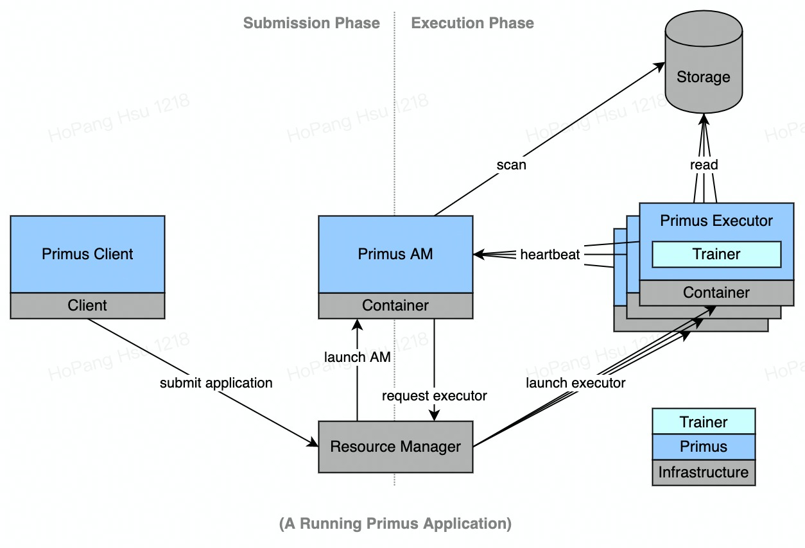
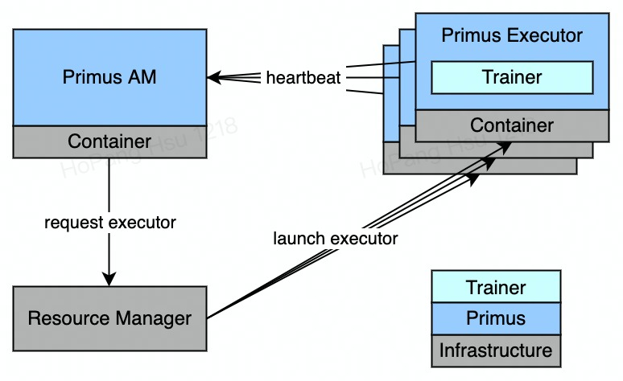
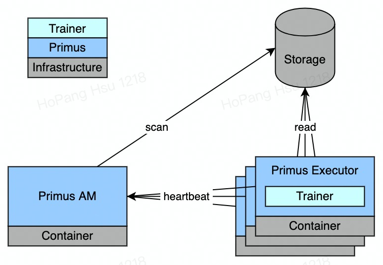

# Primus - Overview

Primus is a generic distributed scheduling framework for machine learning applications, which
manages training lifecycles and data distribution for machine learning trainers such as
TensorFlow to perform distributed training in massive scales.

Given the intrinsic uncertainties in distributed environments, distributed trainings are inevitably
complicated. Abstracting many of those complications, Primus provides a robust solution for data
scientists to concentrate on machine learning algorithms without being distracted by the excessive
details of distributed training.

---

## Anatomy

The lifecycle of a Primus application is composed of two phases, submission phase and execution
phase as illustrated in the diagram below. During submission phase, a Primus application is
submitted to the cluster via Primus client with a curated Primus Configuration along with the needed
resources. After being successfully submitted, the Primus application will enter execution phase
during which the trainer processes are launched and safeguarded by Primus.

### Application Submission

The submission of a Primus application starts with programatically defining the machine learning
application in the format of Primus configuration, which comprises three major categories of
information, training resource, data input and error handling strategy. Firstly, training resource
describes the needed training roles and their resources for the application, where the resources
contain both the training scripts with their environments and computational resources such as CPU
and memory. Secondly, data input instructs Primus how to access and distribute training data to the
corresponding training roles. Last but definitely not the least, error handling strategy guides
Primus how to safeguard the application during hazards.

After the Primus configuration is ready, a Primus application can finally be submitted via Primus
client which launches a dedicated Primus application master on the cluster to manage the execution
of the entire application.

### Lifecycle Management

After being successfully submitted, the lifecycle of the Primus application is managed by its Primus
application master(AM). For each Primus application, their Primus AM launch Primus executors to host
trainer processes for the assigned training roles and keeps monitoring their healthiness, where each
Primus executor periodically updates heartbeat to Primus AM, and Primus AM reacts correspondingly to
secure the entire Primus application.

### Data Injection

Beside managing application lifecycles, Primus is able to affiliate machine learning applications
with data injection, which grants Primus not only the ability to load balance training data across
Primus executors but also the resilience to react lost executors. For data injection, Primus AM
scans the data source defined in Primus configuration, breaks them down into tasks and tracks their
status. As for task distribution, additional to update executor status, Primus executors also update
their task status and fetch new tasks when needed. By executing the tasked assigned by Primus AM,
training data are injected to trainer process by Primus executors in a distributed manner.

---

## What's next

- Get started with [quickstart](primus-quickstart.md).
- Stay tuned for upcoming features!