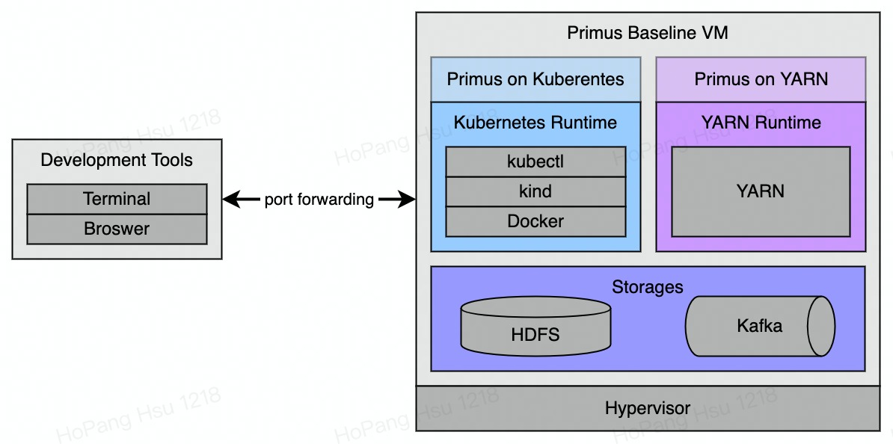
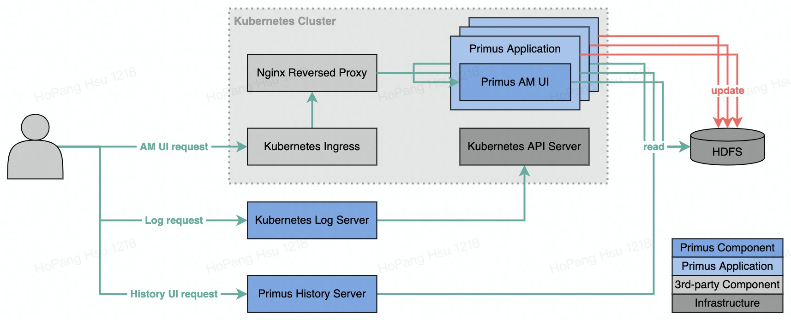
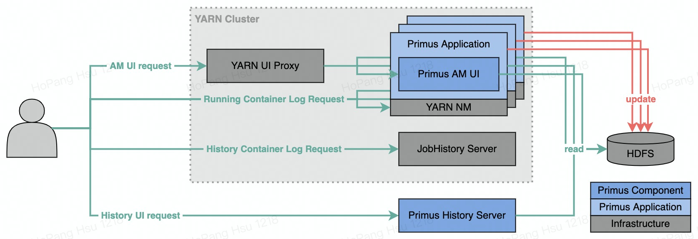

# Primus - Quickstart

Hello developers, welcome to Primus quick start guide. Here we are ensuring you an enjoyable start
with Primus by showing the detailed steps to create standard development environments for
both Primus on Kubernetes and YARN respectively on your local machine, and subsequently submit
example Primus applications to make sure everything is ready to go!


## Primus Baseline Virtual Machine

Being a generic distributed training scheduler, Primus functions in conjunction with many
environmental dependencies, which inevitably hinders developer experiences; therefore, Primus
Baseline Virtual Machine(PBVM) is introduced. By ambitiously encompassing every required
environmental dependencies, PBVM encloses the entire development cycle to local machines, which not
only greatly improves developer experiences but also serves as the standard environments for Primus.



As illustrated in the diagram above, PBVM mainly contains three categories of environmental
dependencies including storages, Kubernetes runtime and YARN runtime, where storages serve both
Primus on Kubernetes and Primus on YARN, while Kubernetes runtime and YARN runtime are only required
by their corresponding Primus deployment.

### Prepare

Being a fully virtualized machine, the construction of PBVM begins with the installation
of a full virtualization hypervisor and creating a virtual machine with the specifications listed
below. Once the VM has been successfully created, setting up SSH with port-forwarding is highly
recommended for various development needs in the future. Besides, a virtual machine snapshot is also
strongly encouraged at the same time.

- Hypervisor: VirtualBox (suggested)
- Operating System: Ubuntu 22.04 Desktop (suggested)
- Hardware spec
    - CPU: 6+
    - Memory: 12G+
    - Disk: 40G+

### Initialize

Having a newly created virtual machine, we now can proceed to installing all the components needed
by PBVM, which can be simply done with the setup script from Primus repository as shown below.
Noticeably, restarting the newly installed PBVM is required to finalise the installation components;
meanwhile, it's a good timing to create another virtual machine snapshot.

```bash
# Primus repository can be obtained from git, scp or other methods.
$ cd <PRIMUS_ROOT>
$ sudo ./deployments/baseline-common/setup.sh $USER
$ sudo shutdown -h now
```

### Verify

With all the components installed, the PBVM now is ready for the deployments of both Primus on
Kubernetes and YARN. However, given the number of installed components, though optional, verifying
the installations would be suggested before proceeding.

#### Docker

Docker is adopted as the container provider for PBVM, which is actually the cornerstone of the
Kubernetes runtime. Moreover, the virtual network interface created by Docker is used as the network
interface for other components within PBVM such as HDFS. To verify docker installation, we can
simply run a hello-world image as shown in the official guide.

```bash
$ docker run hello-world
...
Hello from Docker!
This message shows that your installation appears to be working correctly.
...
```

#### kubectl & kind

kubectl is the standard command line tool of Kubernetes ecosystem, while kind is a single node
Kubernetes cluster solution, based on which PBVM can host a Kubernetes cluster as the resource
orchestrator for Primus on Kubernetes within PBVM, where kind and kubectl can be verified together
as shown below.

```bash
# Check versions
$ kubectl version
WARNING: This version information is deprecated and will be replaced with the output from kubectl version --short.  Use --output=yaml|json to get the full version.
Client Version: version.Info{Major:"1", Minor:"25", GitVersion:"v1.25.0", GitCommit:"a866cbe2e5bbaa01cfd5e969aa3e033f3282a8a2", GitTreeState:"clean", BuildDate:"2022-08-23T17:44:59Z", GoVersion:"go1.19", Compiler:"gc", Platform:"linux/amd64"}
Kustomize Version: v4.5.7
Server Version: version.Info{Major:"1", Minor:"20", GitVersion:"v1.20.15", GitCommit:"8f1e5bf0b9729a899b8df86249b56e2c74aebc55", GitTreeState:"clean", BuildDate:"2022-05-19T20:11:17Z", GoVersion:"go1.15.15", Compiler:"gc", Platform:"linux/amd64"}
WARNING: version difference between client (1.25) and server (1.20) exceeds the supported minor version skew of +/-1

# Check nodes
$ kubectl get nodes
NAME                 STATUS   ROLES                  AGE   VERSION
kind-control-plane   Ready    control-plane,master   12m   v1.20.15
```

#### YARN

As the default resource orchestrator of Hadoop ecosystem, YARN naturally is the other resource
orchestrator inside PBVM. Similar to Kubernetes clusters, YARN installation can be verified by
listing the cluster nodes.

```bash
$ /usr/lib/hadoop/bin/yarn node -list
2022-08-29 23:20:16,324 INFO client.DefaultNoHARMFailoverProxyProvider: Connecting to ResourceManager at /0.0.0.0:8032
Total Nodes:1
Node-Id                  Node-State    Node-Http-Address        Number-of-Running-Containers
primus-baseline:44553    RUNNING       primus-baseline:8042
```

#### HDFS

Being a renowned distributed filesystem, HDFS is selected as the major storage in Primus ecosystem.
HDFS serves as the storages of both Primus internal states and data inputs. During PBVM
initialization, HDFS has been properly configured with the directories needed for Primus
applications, and thus HDFS can be simply verified by listing those directories.

```bash
$ /usr/lib/hadoop/bin/hdfs dfs -ls /primus
Found 3 items
drwxr-xr-x   - primus supergroup          0 2022-08-29 20:46 /primus/event
drwxr-xr-x   - primus supergroup          0 2022-08-29 20:46 /primus/history
drwxr-xr-x   - primus supergroup          0 2022-08-29 20:46 /primus/staging
```

#### Kafka

Different from HDFS, Kafka solely serves as data input source in Primus ecosystem, and thus is
entirely optional in production. Inspired by the official guide, the verification of Kafka is done
by interacting with a created topic.

```bash
# Obtain docker virtual interface IP address on host
$ ip -f inet addr show docker0
3: docker0: <NO-CARRIER,BROADCAST,MULTICAST,UP> mtu 1500 qdisc noqueue state DOWN group default
    inet <DOCKER-HOST-IP>/16 brd 172.17.255.255 scope global docker0
       valid_lft forever preferred_lft forever
       
# Create a new topic
$ cd /usr/lib/kafka
$ bin/kafka-topics.sh --bootstrap-server <DOCKER-HOST-IP>:9092 --create --topic quickstart-events
$ bin/kafka-topics.sh --bootstrap-server <DOCKER-HOST-IP>:9092 --describe --topic quickstart-events
Topic: quickstart-events ...

# Produce events to the newly created topic
$ bin/kafka-console-producer.sh --bootstrap-server <DOCKER-HOST-IP>:9092 --topic quickstart-events
> Kafka says Hello!
> Kafka says Goodbye!
> ^C

# Consume events from the newly created topic
$ bin/kafka-console-consumer.sh --bootstrap-server <DOCKER-HOST-IP>:9092 --topic quickstart-events --from-beginning 
Kafka says Hello!
kafka says Goodbye!
^C

# Delete the test topic
$ bin/kafka-topics.sh --bootstrap-server <DOCKER-HOST-IP>:9092 --delete --topic quickstart-events
```

## Primus on Kubernetes

In this section, we will be setting up the environment for Primus on Kubernetes inside PBVM as
depicted in the diagram below. Remarkably, since Kubernetes clusters are highly configurable, many
environment specific settings are required, and thus the settings demonstrated in this section also
serve as the references for other environments.



### Deployment

To adapt different environments, Primus releases are built into their corresponding deployments,
where each deployment contains the tailored executables and configurations. Hence, deploying Primus
on Kubernetes to PBVM mainly comprises two steps, building and installing the Primus deployment. For
the detailed information, please refer to the corresponding scripts.

```bash
# Build
$ cd <PRIMUS_ROOT>
$ ./deployments/baseline-kubernetes/build.sh --skip-tests

# Install
$ sudo ./deployments/baseline-kubernetes/install.sh $USER 

# Test
$ cd /usr/lib/primus-kubernetes/tests
$ python3 -m robot --variable PRIMUS_HOME:/usr/lib/primus-kubernetes --variable HADOOP_HOME:/usr/lib/hadoop --variable KAFKA_HOME:/usr/lib/kafka basics.robot 
```

### Primus UI

Primus UI is the WebApp displaying the status of Primus Applications. Since the entire baseline
kubernetes environment is encapsulated inside PBVM, sophisticated network settings are required to
allow accesses from the host machine, where the suggested for forwarded ports are listed below.
Importantly, since PBVM doesn't incorporate a network proxy, aligning host ports
and guest ports is strongly advised to prevent esoteric problems.

| Name                               | Protocol | Host Port | Guest Port |
|------------------------------------|----------|-----------|------------|
| Kubernetes Ingress HTTP            | TCP      | 80        | 80         |
| Kubernetes Log Server              | TCP      | 7891      | 7891       |
| Primus History Server (Kubernetes) | TCP      | 7890      | 7890       |

### Hello Primus on Kubernetes!

After the long preparation, the newly created PBVM is finally ready for Primus application
submissions on Kubernetes, which can be easily done with the commands below. After being
successfully submitted, the driver pod name of the Primus application will be printed as
shown in the snippet below, which is the key information for future debugging.

```bash
$ cd /usr/lib/primus-kubernetes 
$ sbin/primus-submit --primus_conf examples/hello/primus_config.json
...
[2022-08-30 15:05:31:685] [INFO] - com.bytedance.primus.runtime.kubernetesnative.client.KubernetesSubmitCmdRunner.printDebugInfo(KubernetesSubmitCmdRunner.java:194) =================================================================
[2022-08-30 15:05:31:687] [INFO] - com.bytedance.primus.runtime.kubernetesnative.client.KubernetesSubmitCmdRunner.printDebugInfo(KubernetesSubmitCmdRunner.java:195) Kubernetes AM tracking URL: http://localhost/primus/app/proxy/<DRIVER-POD-NAME>/
[2022-08-30 15:05:31:687] [INFO] - com.bytedance.primus.runtime.kubernetesnative.client.KubernetesSubmitCmdRunner.printDebugInfo(KubernetesSubmitCmdRunner.java:198) Kubernetes History tracking URL: http://localhost:7890/app/<DRIVER-POD-NAME>/
[2022-08-30 15:05:31:688] [INFO] - com.bytedance.primus.runtime.kubernetesnative.client.KubernetesSubmitCmdRunner.printDebugInfo(KubernetesSubmitCmdRunner.java:201) Kubernetes logs command: kubectl -n primus logs <DRIVER-POD-NAME>
[2022-08-30 15:05:31:688] [INFO] - com.bytedance.primus.runtime.kubernetesnative.client.KubernetesSubmitCmdRunner.printDebugInfo(KubernetesSubmitCmdRunner.java:203) Kubernetes exec command: kubectl -n primus exec -it <DRIVER-POD-NAME> -- bash
[2022-08-30 15:05:31:688] [INFO] - com.bytedance.primus.runtime.kubernetesnative.client.KubernetesSubmitCmdRunner.printDebugInfo(KubernetesSubmitCmdRunner.java:205) Kubernetes list pod command: kubectl -n primus get pods | grep <DRIVER-POD-NAME>
[2022-08-30 15:05:31:688] [INFO] - com.bytedance.primus.runtime.kubernetesnative.client.KubernetesSubmitCmdRunner.printDebugInfo(KubernetesSubmitCmdRunner.java:207) =================================================================
...
[2022-08-15 14:56:57:130] [INFO] - ... current driver pod status: Succeeded
```

Later, the execution of Primus applications can be verified by observing the logs through either CLI
or Primus UI if it has been properly setup in the previous step.

```bash
$ kubectl -n primus get pods | grep <DRIVER-POD-NAME> 
<DRIVER-POD-NAME>                       0/1     Completed   0          10m
<DRIVER-POD-NAME>-executor-chief-0-3    0/1     Completed   0          9m12s
<DRIVER-POD-NAME>-executor-ps-0-1       0/1     Completed   0          9m12s
<DRIVER-POD-NAME>-executor-worker-0-2   0/1     Completed   0          9m12s

$ kubectl -n primus logs <DRIVER-POD-NAME>-executor-chief-0-3 | grep Hello
Hello from Chief
$ kubectl -n primus logs <DRIVER-POD-NAME>-executor-ps-0-1 | grep Hello
Hello from PS
$ kubectl -n primus logs <DRIVER-POD-NAME>-executor-worker-0-2 | grep Hello
Hello from Worker
```

## Primus on YARN

As its counterpart for Primus on Kubernetes, this section will be demonstrating the process of
deploying Primus on YARN to PBVM with the architecture depicted in the diagram below, and wrapped up
by submitting a Primus application.



### Deployment

Similarly, deploying Primus on YARN starts with building the corresponding Primus deployment, and
followed by the installation of the Primus deployment.

```bash
# Build
$ cd <PRIMUS_ROOT>
$ ./deployments/baseline-yarn/build.sh --skip-tests

# Install
$ sudo ./deployments/baseline-yarn/install.sh $USER 

# Test
$ cd /usr/lib/primus-yarn/tests
$ python3 -m robot --variable PRIMUS_HOME:/usr/lib/primus-yarn --variable HADOOP_HOME:/usr/lib/hadoop --variable KAFKA_HOME:/usr/lib/kafka basics.robot 
```

### Primus UI

For the same reason for components in the baseline Kubernetes environment, components in baseline
YARN environment have to be forwarded to serve external requests, where the suggested mapping are
listed below.

| Name                         | Protocol | Host Port | Guest Port |
|------------------------------|----------|-----------|------------|
| YARN UI                      | TCP      | 8088      | 8088       |
| YARN Node Manager            | TCP      | 8042      | 8042       |
| YARN Job History             | TCP      | 19888     | 19888      |
| Primus History Server (YARN) | TCP      | 17890     | 17890      |

However, since customized application master URLs are not supported by YARN and proxies are not
adopted in baseline-yarn environment, we have to extend the hostname mappings on the host machine by
pointing the hostname of PBVM to 127.0.0.1, through which requests will be eventually redirected to
components inside PBVM via the forwarded ports configured slightly earlier.

```bash
$ sudo cat "127.0.0.1 <PBVM-HOSTNAME>" > /etc/hosts
```

### Hello Primus on YARN!

Finally, we can submit Primus applications again! As shown below, submitting Primus applications on
YARN environment is nearly identical to submitting on Kubernetes environment.

```bash
$ cd /usr/lib/primus-yarn
$ sbin/primus-submit --primus_conf examples/hello/primus_config.json
...
2022-08-15 15:23:14,066 INFO impl.YarnClientImpl: Submitted application <YARN-APPLICATION-ID>
2022-08-15 15:23:14,068 INFO client.YarnSubmitCmdRunner: Tracking URL: http://primus-aio:8088/proxy/<YARN-APPLICATION-ID>/
2022-08-15 15:23:21,094 INFO client.YarnSubmitCmdRunner: Training successfully started. Scheduling took 7028 ms.
2022-08-15 15:24:23,285 INFO client.YarnSubmitCmdRunner: State: FINISHED  Progress: 100.0%
2022-08-15 15:24:23,288 INFO client.YarnSubmitCmdRunner: Application <YARN-APPLICATION-ID> finished with state FINISHED at 2022-08-15 15:24
```

Once again, the execution of Primus applications can be verified by either observing the logs
through CLI or Primus UI if it has been configured starting from YARN cluster UI
at http://localhost:8088.

```bash
$ yarn logs --applicationId <YARN-APPLICATION-ID> | grep -E "^Hello"
Hello from Worker
Hello from Chief
Hello from PS
```

## What's next?

Congratulations on completing this guide, and feel free to check out [examples](../examples) for
more Primus features in action!
